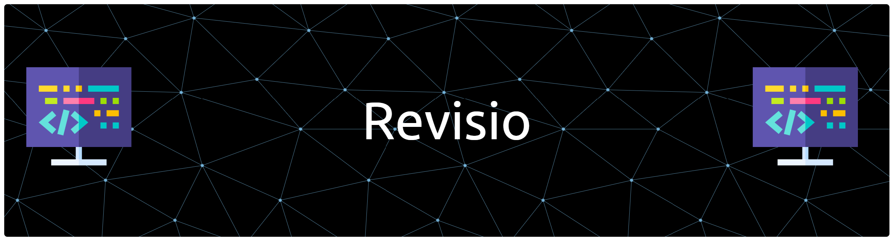

<div align="center">

 

  <br/>
  <br/>

 <a href="https://git.io/typing-svg">
    
</a>

  <br/>

  <p>
    
    
    
  </p>

</div>

---

<div align="center"> 

## 🛠️ The Tech Stack

</div>

<div align="center">
	<code></code>
	<code></code>
	<code></code>
	<code></code>
	<code></code>
	<code></code>
	<code></code>
	<code></code>
	<code></code>
	<code></code>
	<code></code>
	<code></code>
</div>

<br/>

## ⚡ Introduction

**Revisio** is a cutting-edge educational assessment platform designed to help Computer Science students master core concepts. It is built using the latest **Angular 19** and **NestJS 11**, ensuring blazingly fast performance and a modern architecture.

> *"More than just a quiz app—it's an intelligent study companion."*

<br/>

## 🖥️ Live Application Demo

<div align="center">
	

https://github.com/user-attachments/assets/46b5d782-17fb-47db-8cc8-2f9d30da7c36


</div>

<br/>

## Folder Structure

```

.
├── 📂 frontend                        # Angular 19 Client
│   ├── 📂 src/app
│   │   ├── 📂 auth                    # 🔐 Login, Signup, OTP & 2FA
│   │   ├── 📂 dashboard               # 📊 Main User Layout
│   │   │   ├── 📂 overview            #    ├── Stats & Progress Charts
│   │   │   ├── 📂 assessment          #    ├── Test Creation Logic
│   │   │   ├── 📂 chatbot             #    ├── 🤖 RAG AI Assistant
│   │   │   ├── 📂 test-taking         #    ├── 🛡️ Anti-Cheat & Proctoring
│   │   │   └── 📂 test-result         #    └── Performance Analytics
│   │   ├── 📂 services                # 🔌 API Communication Services
│   │   ├── 📂 models                  # 📦 TypeScript Interfaces
│   │   └── 📂 shared                  # 🧱 Reusable Components (PrimeNG)
│   └── 📂 environments                # ⚙️ API Keys & Config
│
└── 📂 backend                         # NestJS 11 Server
    ├── 📂 src
    │   ├── 📂 auth                    # 🔐 JWT Strategies & Guards
    │   ├── 📂 questions               # ❓ Question Bank Management
    │   ├── 📂 test-config             # ⚙️ Assessment Rules & Settings
    │   ├── 📂 test-results            # 📈 Scoring & Calculation Engine
    │   ├── 📂 email                   # 📧 Nodemailer Service
    │   ├── 📂 schemas                 # 🗄️ MongoDB/Mongoose Models
    │   └── 📂 dtos                    # 📨 Data Transfer Objects
    └── 📜 main.ts                     #    Entry Point

```
## 🌟 Key Features

<table width="100%">
  <tr>
    <td width="50%" valign="top">
      <h3 align="center">🔐 Advanced Authentication</h3>
      <p align="center">
        <i>Secure access with military-grade standards.</i>
      </p>
      <ul>
        <li><b>JWT Session:</b> Stateless, secure token management.</li>
        <li><b>2-Factor Auth (2FA):</b> OTP verification via Email.</li>
        <li><b>Recovery:</b> Secure password reset flows.</li>
      </ul>
      <br/>
      <div align="center">
        
      </div>
    </td>
    <td width="50%" valign="top">
      <h3 align="center">🛡️ Smart Proctoring</h3>
      <p align="center">
        <i>Automated anti-cheat environment.</i>
      </p>
      <ul>
        <li><b>Focus Detection:</b> Detects tab switching & window blur.</li>
        <li><b>Auto-Submit:</b> Triggers on timer expiry or violation.</li>
        <li><b>Strict Timer:</b> Server-synced countdown.</li>
      </ul>
      <br/>
      <div align="center">
        
      </div>
    </td>
  </tr>
  <tr>
    <td width="50%" valign="top">
      <h3 align="center">🤖 RAG AI Assistant</h3>
      <p align="center">
        <i>Powered by CorpusAI for contextual help.</i>
      </p>
      <ul>
        <li><b>Context Aware:</b> RAG system for PF concepts.</li>
        <li><b>Smart UI:</b> Typing indicators & chat history.</li>
        <li><b>Integration:</b> Seamless REST API connection.</li>
      </ul>
      <br/>
      <div align="center">
        
      </div>
    </td>
    <td width="50%" valign="top">
      <h3 align="center">📊 Deep Analytics</h3>
      <p align="center">
        <i>Visualizing progress with ngx-charts.</i>
      </p>
      <ul>
        <li><b>Performance:</b> Category-wise (OOP, DSA, PF) breakdown.</li>
        <li><b>History:</b> Track pass/fail rates over time.</li>
        <li><b>Visuals:</b> Interactive bar and pie charts.</li>
      </ul>
      <br/>
      <div align="center">
        
      </div>
    </td>
  </tr>
</table>

<br/>

<details>
<summary><b>🔻 Click here to view the Technical Workflow (How it works)</b></summary>
<br>

| **Component** | **Technical Implementation** |
| :--- | :--- |
| **Question Bank** | Stored in MongoDB with randomized selection algorithms based on complexity. |
| **RAG System** | Fetches embeddings from CorpusAI to answer student queries without hallucinations. |
| **State Mgmt** | RxJS BehaviorSubjects used for real-time timer synchronization across components. |

</details>## 🌟 Key Features

<table width="100%">
  <tr>
    <td width="50%" valign="top">
      <h3 align="center">🔐 Advanced Authentication</h3>
      <p align="center">
        <i>Secure access with military-grade standards.</i>
      </p>
      <ul>
        <li><b>JWT Session:</b> Stateless, secure token management.</li>
        <li><b>2-Factor Auth (2FA):</b> OTP verification via Email.</li>
        <li><b>Recovery:</b> Secure password reset flows.</li>
      </ul>
      <br/>
      <div align="center">
        
      </div>
    </td>
    <td width="50%" valign="top">
      <h3 align="center">🛡️ Smart Proctoring</h3>
      <p align="center">
        <i>Automated anti-cheat environment.</i>
      </p>
      <ul>
        <li><b>Focus Detection:</b> Detects tab switching & window blur.</li>
        <li><b>Auto-Submit:</b> Triggers on timer expiry or violation.</li>
        <li><b>Strict Timer:</b> Server-synced countdown.</li>
      </ul>
      <br/>
      <div align="center">
        
      </div>
    </td>
  </tr>
  <tr>
    <td width="50%" valign="top">
      <h3 align="center">🤖 RAG AI Assistant</h3>
      <p align="center">
        <i>Powered by CorpusAI for contextual help.</i>
      </p>
      <ul>
        <li><b>Context Aware:</b> RAG system for PF concepts.</li>
        <li><b>Smart UI:</b> Typing indicators & chat history.</li>
        <li><b>Integration:</b> Seamless REST API connection.</li>
      </ul>
      <br/>
      <div align="center">
        
      </div>
    </td>
    <td width="50%" valign="top">
      <h3 align="center">📊 Deep Analytics</h3>
      <p align="center">
        <i>Visualizing progress with ngx-charts.</i>
      </p>
      <ul>
        <li><b>Performance:</b> Category-wise (OOP, DSA, PF) breakdown.</li>
        <li><b>History:</b> Track pass/fail rates over time.</li>
        <li><b>Visuals:</b> Interactive bar and pie charts.</li>
      </ul>
      <br/>
      <div align="center">
        
      </div>
    </td>
  </tr>
</table>

<br/>

<details>
<summary><b>🔻 Click here to view the Technical Workflow (How it works)</b></summary>
<br>

| **Component** | **Technical Implementation** |
| :--- | :--- |
| **Question Bank** | Stored in MongoDB with randomized selection algorithms based on complexity. |
| **RAG System** | Fetches embeddings from CorpusAI to answer student queries without hallucinations. |
| **State Mgmt** | RxJS BehaviorSubjects used for real-time timer synchronization across components. |

</details>

## Installation & Run Instructions

### Prerequisites
- Node.js (v18 or higher)
- MongoDB (running on localhost:27017)
- Email service credentials (for OTP)

### Backend Setup
```bash
cd backend
npm install
# Create .env file with:
# EMAIL_HOST=your-smtp-host
# EMAIL_USERNAME=your-email
# EMAIL_PASSWORD=your-password
# PORT=3000
npm run start:dev
```

### Frontend Setup
```bash
cd frontend
npm install
# Update environment.development.ts with your API keys
# Create Chatbot, train it and put MODEL_API_KEY & YOUR_CHATBOT_API_KEY in environment folder
npm start
```

### Database Setup
```bash
# MongoDB should be running on localhost:27017
# Database name: concept-revise
# Collections will be created automatically
```
## 🔌 API Reference & Endpoints

<div align="center">
  <i>Click on the sections below to expand request details.</i>
  <br/>
  <br/>
</div>

<details>
<summary><b>🔐 Authentication Module</b> (Signup, Login, OTP)</summary>
<br/>

| Method | Endpoint | Description |
| :--- | :--- | :--- |
|  | `/auth/signup` | Register a new user account |
|  | `/auth/signin` | Login using email & OTP |
|  | `/auth/resend-otp` | Resend 2FA verification code |
|  | `/auth/forgot-password` | Initiate password recovery flow |
|  | `/auth/reset-password` | Reset password using valid token |

</details>

<details>
<summary><b>⚙️ Test Configuration</b> (Create & Manage Tests)</summary>
<br/>

| Method | Endpoint | Description |
| :--- | :--- | :--- |
|  | `/test-config/create` | Initialize a new test session |
|  | `/test-config/start` | Begin the countdown timer |
|  | `/test-config/user-configs` | Fetch all tests for current user |
|  | `/test-config/:id` | Get specific test metadata |

</details>

<details>
<summary><b>📊 Results & Analytics</b> (Scoring & Statistics)</summary>
<br/>

| Method | Endpoint | Description |
| :--- | :--- | :--- |
|  | `/test-results/submit` | Submit answers for grading |
|  | `/test-results/user-results` | Get history of all attempts |
|  | `/test-results/statistics` | Fetch chart data for dashboard |
|  | `/test-results/:id` | Get detailed report card |

</details>

<details>
<summary><b>🛠️ Utilities</b> (Questions & Email)</summary>
<br/>

| Method | Endpoint | Description |
| :--- | :--- | :--- |
|  | `/questions/seed` | <b>[Admin]</b> Seed DB with sample questions |
|  | `/email/check` | Verify email availability |

</details>
---

<div align="center">

  <h3>
    
    Thank you for exploring Revisio!
  </h3>

  <p>
    This project was a significant milestone in my <b>Full-Stack Development</b> journey.
    <br>
    I am grateful for the opportunity to share this learning experience with you.
  </p>

  <p>
    <i>If you found this project interesting, please consider giving it a star!</i>
    <br>
    <br>
    <a href="https://github.com/SyedMuhammadHunain/revisio-app/stargazers">
      
    </a>
  </p>

  <br>

  <h3>
    <i>Happy Coding!</i> &nbsp;
    
  </h3>

</div>

<br>
